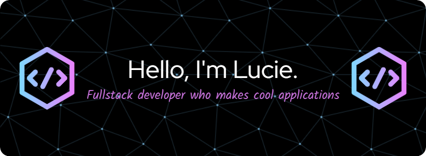

 

## 🍵  About me

- 💼 Graduate **Full-Stack** student at [Illinois Tech](https://www.iit.edu/) and [ESEO France](https://eseo.fr/en/)

- 📈 Built apps with Spring Boot, Next.js, Express.js, etc.

- ❤️ I love writing Java and Javascript

- 💬 Ask me about anything [here](https://github.com/yelucie/yelucie/issues)

## 🛠  What I use

[<img src="https://img.shields.io/badge/Java-282C34.svg?logo=data:image/svg+xml;base64,PD94bWwgdmVyc2lvbj0iMS4wIiBlbmNvZGluZz0iaXNvLTg4NTktMSI/Pg0KPCEtLSBVcGxvYWRlZCB0bzogU1ZHIFJlcG8sIHd3dy5zdmdyZXBvLmNvbSwgR2VuZXJhdG9yOiBTVkcgUmVwbyBNaXhlciBUb29scyAtLT4NCjxzdmcgaGVpZ2h0PSI4MDBweCIgd2lkdGg9IjgwMHB4IiB2ZXJzaW9uPSIxLjEiIGlkPSJMYXllcl8xIiB4bWxucz0iaHR0cDovL3d3dy53My5vcmcvMjAwMC9zdmciIHhtbG5zOnhsaW5rPSJodHRwOi8vd3d3LnczLm9yZy8xOTk5L3hsaW5rIiANCgkgdmlld0JveD0iMCAwIDUxMS45OTggNTExLjk5OCIgeG1sOnNwYWNlPSJwcmVzZXJ2ZSI+DQo8Zz4NCgk8cGF0aCBzdHlsZT0iZmlsbDojREIzODBFOyIgZD0iTTI1My40NjQsOTQuODY5Yy0yMy42NTgsMTYuNjM5LTUwLjQ3MSwzNS40OTgtNjQuODM4LDY2LjY5OQ0KCQljLTI0Ljk1NCw1NC40MzUsNTEuMDYyLDExMy44MTIsNTQuMzExLDExNi4zMTNjMC43NTUsMC41ODEsMS42NTksMC44NzEsMi41NiwwLjg3MWMwLjk1NywwLDEuOTE1LTAuMzI3LDIuNjkzLTAuOTc5DQoJCWMxLjUwOS0xLjI2MiwxLjkzNy0zLjQwNiwxLjAzMS01LjE1MmMtMC4yNzUtMC41My0yNy41NjEtNTMuNTMtMjYuNTQ3LTkxLjU1MmMwLjM1OS0xMy4yNDMsMTguODkyLTI4LjI2NiwzOC41MTItNDQuMTcxDQoJCWMxNy45Ny0xNC41NjgsMzguMzQtMzEuMDc5LDUwLjI1OC01MC4zOTRjMjYuMTY0LTQyLjUxNi0yLjkxNi04NC4zMjItMy4yMTMtODQuNzRjLTEuMTU1LTEuNjIyLTMuMjg3LTIuMjA5LTUuMTEtMS40MQ0KCQljLTEuODIxLDAuODA0LTIuODMsMi43NzMtMi40MTQsNC43MmMwLjA1OSwwLjI3Nyw1LjcxNCwyNy45MjMtMTAuMDIyLDU2LjQwNkMyODQuMjAzLDczLjI1LDI2OS45NTksODMuMjY4LDI1My40NjQsOTQuODY5eiIvPg0KCTxwYXRoIHN0eWxlPSJmaWxsOiNEQjM4MEU7IiBkPSJNMzUzLjEzNywxMTMuNjE3YzEuNjY5LTEuMjU3LDIuMTU5LTMuNTUsMS4xNS01LjM4Yy0xLjAxMS0xLjgzLTMuMjExLTIuNjM3LTUuMTY1LTEuODk1DQoJCWMtNC4wMTksMS41MjgtOTguNDE2LDM3LjkxNS05OC40MTYsODEuODhjMCwzMC4zMDcsMTIuOTQ2LDQ2LjMxNywyMi4zOTksNTguMDA5YzMuNzA4LDQuNTg2LDYuOTA5LDguNTQ2LDcuOTY0LDExLjkyNw0KCQljMi45Nyw5Ljc0My00LjA2NiwyNy4zNTMtNy4wMjUsMzMuMzE3Yy0wLjg1MywxLjcxNC0wLjQzNSwzLjc5MiwxLjAxNiw1LjA0NGMwLjc4NCwwLjY3NywxLjc2MywxLjAyMSwyLjc0MywxLjAyMQ0KCQljMC44MzQsMCwxLjY3Mi0wLjI0OCwyLjM5Ni0wLjc1MmMxLjYyMy0xLjEyOCwzOS42NjctMjguMDI2LDMyLjg0NC02MC40MzNjLTIuNTQyLTEyLjMxOC04LjU5NS0yMS4zMTgtMTMuOTM2LTI5LjI2DQoJCWMtOC4yNzQtMTIuMzA1LTE0LjI1LTIxLjE5My01LjE4NC0zNy42MDlDMzA0LjU0NSwxNTAuMzM4LDM1Mi42NSwxMTMuOTgxLDM1My4xMzcsMTEzLjYxN3oiLz4NCjwvZz4NCjxnPg0KCTxwYXRoIHN0eWxlPSJmaWxsOiM3M0ExRkI7IiBkPSJNMTA3LjQxOCwyOTguMjM2Yy0xLjYxOCw0Ljg0NS0wLjg1NCw5LjY1MSwyLjIwNywxMy45MDNjMTAuMjMzLDE0LjIwNyw0Ni40OCwyMi4wMjksMTAyLjA2OCwyMi4wMjkNCgkJYzAuMDAzLDAsMC4wMDUsMCwwLjAwNywwYzcuNTMyLDAsMTUuNDg0LTAuMTQ4LDIzLjYyOS0wLjQ0Yzg4Ljg3NS0zLjE4MSwxMjEuODM5LTMwLjg2OSwxMjMuMTk5LTMyLjA0Ng0KCQljMS40ODItMS4yODMsMS44NzgtMy40MTksMC45NTctNS4xNDdjLTAuOTIyLTEuNzI3LTIuOTA5LTIuNTk1LTQuODA4LTIuMDcyYy0zMS4zMDEsOC41NDYtODkuNzQ4LDExLjU4LTEzMC4yODgsMTEuNTgNCgkJYy00NS4zNjMsMC02OC40NjUtMy4yNjgtNzQuMTIxLTUuNjgxYzIuOTAyLTMuOTg1LDIwLjgwMi0xMS4xMDEsNDIuOTgzLTE1LjQ2NGMyLjEyLTAuNDE2LDMuNTc3LTIuMzc0LDMuMzY3LTQuNTI0DQoJCXMtMi4wMTYtMy43OS00LjE3Ny0zLjc5QzE3OS40MzksMjc2LjU4NCwxMTQuMjM0LDI3Ny42MjgsMTA3LjQxOCwyOTguMjM2eiIvPg0KCTxwYXRoIHN0eWxlPSJmaWxsOiM3M0ExRkI7IiBkPSJNNDA0LjgxMiwyNjkuNzE4Yy0xOC4zMzEsMC0zNS43MTQsOS4xODgtMzYuNDQ2LDkuNTc3Yy0xLjY5NSwwLjkwOC0yLjU1NSwyLjg1Mi0yLjA5LDQuNzINCgkJYzAuNDY3LDEuODY1LDIuMTQ0LDMuMTc2LDQuMDY3LDMuMTc4YzAuMzg5LDAsMzkuMTAyLDAuMzE3LDQyLjYwOCwyMi40MzZjMy4xMDYsMTkuMDgyLTM2LjYyOSw1MC01Mi4yMDIsNjAuMzA0DQoJCWMtMS42ODIsMS4xMTMtMi4zMzUsMy4yNjMtMS41NTQsNS4xMjNjMC42NjUsMS41ODMsMi4yMDYsMi41NzMsMy44NjgsMi41NzNjMC4yOSwwLDAuNTg0LTAuMDMsMC44NzYtMC4wOTINCgkJYzMuNjk2LTAuNzkxLDkwLjQwNi0xOS44OTksODEuMjM4LTcwLjM4NEM0MzkuNTg0LDI3Ni4yMTMsNDIwLjEzOCwyNjkuNzE4LDQwNC44MTIsMjY5LjcxOHoiLz4NCgk8cGF0aCBzdHlsZT0iZmlsbDojNzNBMUZCOyIgZD0iTTM0NS4zNDcsMzYzLjc1NWMwLjMwMi0xLjYxNy0wLjM3MS0zLjI2Mi0xLjcxNy00LjIwN2wtMjAuNzkxLTE0LjU2Mw0KCQljLTEuMDE0LTAuNzEtMi4yOTUtMC45MzMtMy40ODUtMC42MThjLTAuMjE3LDAuMDU1LTIxLjk1OSw1Ljc3MS01My41MjUsOS4yNzZjLTEyLjUyOCwxLjQwNS0yNi41NiwyLjE0Ny00MC41ODIsMi4xNDcNCgkJYy0zMS41NTgsMC01Mi4xOTItMy43MDgtNTUuMTk3LTYuNDI4Yy0wLjM5OC0wLjc2NC0wLjI3Mi0xLjExMS0wLjIwMS0xLjMwNGMwLjU0Ni0xLjUxOCwzLjQ3Mi0zLjMyMiw1LjM1OC00LjAzNg0KCQljMi4wODMtMC43NzEsMy4yMDYtMy4wMzMsMi41NTgtNS4xNTdjLTAuNjQ2LTIuMTI3LTIuODM3LTMuMzc4LTQuOTk5LTIuODU5Yy0yMC44NTYsNS4wMzMtMzEuMDU0LDEyLjA3MS0zMC4zMTIsMjAuOTE4DQoJCWMxLjMxOCwxNS42ODYsMzcuNjUsMjMuNzM3LDY4LjM2NSwyNS44NjVjNC40MTcsMC4zMDIsOS4xOTQsMC40NTUsMTQuMTk1LDAuNDU1YzAuMDAzLDAsMC4wMDUsMCwwLjAwOCwwDQoJCWM1MS4wNzQsMCwxMTYuNTUtMTYuMDI1LDExNy4yMDQtMTYuMTg4QzM0My44MjUsMzY2LjY2NiwzNDUuMDQ0LDM2NS4zNzUsMzQ1LjM0NywzNjMuNzU1eiIvPg0KCTxwYXRoIHN0eWxlPSJmaWxsOiM3M0ExRkI7IiBkPSJNMTg4LjYwMiwzOTcuNDE5YzEuNTc1LTEuMDI0LDIuMjczLTIuOTcxLDEuNzE0LTQuNzY0Yy0wLjU1Ny0xLjc5My0yLjIzNC0yLjk3MS00LjExOC0yLjk0Ng0KCQljLTIuNzk1LDAuMDc0LTI3LjM0OSwxLjE4Mi0yOS4wNjgsMTYuODE1Yy0wLjUyLDQuNjcyLDAuODE4LDguOTQxLDMuOTc5LDEyLjY4NmM4LjgxNiwxMC40NDgsMzIuNjE0LDE2LjY1OCw3Mi43NDEsMTguOTg0DQoJCWM0Ljc0NywwLjI4NSw5LjU2OSwwLjQyOCwxNC4zMzQsMC40MjhjNTEuMDE1LDAsODUuMzczLTE1Ljk3Myw4Ni44MTItMTYuNjUzYzEuMzk1LTAuNjYsMi4zMTUtMi4wMzEsMi4zOTctMy41NzENCgkJcy0wLjY4Ny0zLjAwMS0yLjAwMy0zLjgwNmwtMjYuMjc1LTE2LjA0Yy0wLjkxMi0wLjU1Ni0yLjAwMy0wLjc0LTMuMDQzLTAuNTI3Yy0wLjE2NiwwLjAzNS0xNi44NDksMy40OTUtNDIuMDI2LDYuOTEzDQoJCWMtNC43NjQsMC42NDgtMTAuNzMsMC45NzctMTcuNzMsMC45NzdjLTI1LjE1LDAtNTMuMTI0LTQuMTA5LTU4LjQ4OS02LjhDMTg3Ljc0OSwzOTguNjEzLDE4Ny44NDgsMzk3Ljk3NSwxODguNjAyLDM5Ny40MTl6Ii8+DQoJPHBhdGggc3R5bGU9ImZpbGw6IzczQTFGQjsiIGQ9Ik0yMjQuNDA4LDQ4Ni44NWMxMTYuODU0LTAuMDk5LDE3OS41NzEtMjAuODgsMTkxLjY1My0zMy45NTdjNC4yNzctNC42MjYsNC43MzktOS4wMDYsNC4zNzYtMTEuODY3DQoJCWMtMC44OTgtNy4wNC03LjMxMS0xMS4zNS04LjAzOC0xMS44MThjLTEuNzU0LTEuMTI4LTQuMTA4LTAuODMzLTUuNDc2LDAuNzQ1Yy0xLjM2NSwxLjU3OC0xLjM5NywzLjg4NC0wLjAyNyw1LjQ2MQ0KCQljMC43MzcsMC45NDgsMS4xNjMsMi41MzUtMC45OTIsNC42OTJjLTQuODMsNC41MTEtNTMuNTQ1LDE4LjIwNC0xMzQuNjU2LDIyLjMxOGMtMTEuMTExLDAuNTc3LTIyLjc2NSwwLjg3MS0zNC42MzYsMC44NzMNCgkJYy03Mi42MjMsMC0xMjUuNzcyLTkuOTQ4LTEzMi43NDktMTUuNzQ0YzIuNjg5LTMuODY0LDIxLjQ4OS0xMC4wMzcsNDEuNDgyLTEzLjUyOWMyLjI1My0wLjM5MywzLjc3NS0yLjUxNiwzLjQyNi00Ljc3Ng0KCQljLTAuMzQ5LTIuMjU5LTIuNDMyLTMuODE0LTQuNzA5LTMuNTE5Yy0wLjU2NCwwLjA3Ny0yLjQ3OCwwLjE5MS00LjY5NCwwLjMyN2MtMzIuOTg4LDIuMDE0LTcxLjEwOSw2LjUwMy03My4wOTgsMjMuNQ0KCQljLTAuNjA0LDUuMTc5LDAuOTM1LDkuODgxLDQuNTc2LDEzLjk3M2M4LjkwOSwxMC4wMSwzNC41MTYsMjMuMzE5LDE1My41NTgsMjMuMzE5QzIyNC40MDYsNDg2Ljg1LDIyNC40MDYsNDg2Ljg1LDIyNC40MDgsNDg2Ljg1eiINCgkJLz4NCgk8cGF0aCBzdHlsZT0iZmlsbDojNzNBMUZCOyIgZD0iTTQzOS4wMTMsNDU2LjU3OGMtMS42NTItMC43NjQtMy42MDQtMC4zNzgtNC44MzYsMC45NTJjLTAuMTcxLDAuMTg1LTE3Ljc0LDE4LjU1Ni03MC41NjQsMjkuMzQ0DQoJCWMtMjAuMjIzLDQuMDUyLTU4LjE4Myw2LjEwNy0xMTIuODI2LDYuMTA3Yy01NC43NDUsMC0xMDYuODM4LTIuMTU0LTEwNy4zNTctMi4xNzZjLTIuMTc2LTAuMTA2LTQuMDM3LDEuNDc2LTQuMzMzLDMuNjE4DQoJCWMtMC4yOTcsMi4xNCwxLjA4Myw0LjE1OCwzLjE4NCw0LjY1OGMwLjU0MiwwLjEyOCw1NS4xMzUsMTIuOTE4LDEyOS43NzksMTIuOTE4YzM1LjgwMSwwLDcwLjYzOS0yLjkwNywxMDMuNTQ4LTguNjQ1DQoJCWM2MS4zNjEtMTAuNzU3LDY1LjY1Ny00MS4xODMsNjUuODEtNDIuNDczQzQ0MS42MzIsNDU5LjA3OCw0NDAuNjYyLDQ1Ny4zNDIsNDM5LjAxMyw0NTYuNTc4eiIvPg0KPC9nPg0KPC9zdmc+" alt="Java logo" title="Java" height="25" />][tech_tools_anchor]
&nbsp;
[][tech_tools_anchor]
&nbsp;
[][tech_tools_anchor]
&nbsp;
[][tech_tools_anchor]
&nbsp;
[][tech_tools_anchor]
&nbsp;
[][tech_tools_anchor]
&nbsp;
[][tech_tools_anchor]
&nbsp;
[][tech_tools_anchor]
&nbsp;

[][tech_tools_anchor]
&nbsp;
[][tech_tools_anchor]
&nbsp;
[][tech_tools_anchor]
&nbsp;
[][tech_tools_anchor]
&nbsp;
[][tech_tools_anchor]
&nbsp;
[][tech_tools_anchor]
&nbsp;
[][tech_tools_anchor]
&nbsp;

[][tech_tools_anchor]
&nbsp;
[][tech_tools_anchor]
&nbsp;
[][tech_tools_anchor]
&nbsp;
[][tech_tools_anchor]
&nbsp;

## 📖  What I am currently learning / improving on

[][learning_now_anchor]
&nbsp;
[][learning_now_anchor]
&nbsp;
[][learning_now_anchor]
&nbsp;
[][learning_now_anchor]
&nbsp;

## 👾  What I am interested in learning at some point

[][learning_next_anchor]
&nbsp;
[][learning_next_anchor]
&nbsp;
[][learning_next_anchor]
&nbsp;

## ⭐  Top Projects

## 📈  My GitHub Stats

    
    

[tech_tools_anchor]: #🛠-what-i-use
[learning_now_anchor]: #📖-what-i-am-currently-learning--improving-on
[learning_next_anchor]: #👾-what-i-am-interested-in-learning-at-some-point
